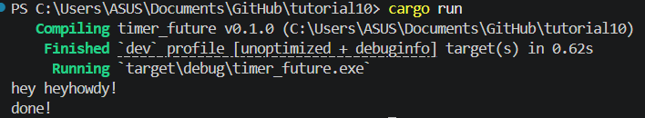

# tutorial10

Ini terjadi karena spawner.spawn() tidak menjalankan future secara langsung dia hanya memasukkan task ke queue.
Jadi seperti
spawn() → task masuk queue, tidak langsung poll
print!("hey hey") → langsung output
executor.run() → baru poll future, print "howdy!"