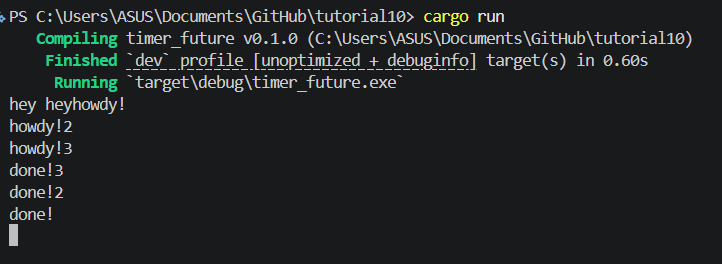

# tutorial10

Ini terjadi karena spawner.spawn() tidak menjalankan future secara langsung dia hanya memasukkan task ke queue.
Jadi seperti
spawn() -> task masuk queue, tidak langsung poll
print!("hey hey") -> langsung output
executor.run() -> baru poll future, print "howdy!"

Karena semua task di-spawn terlebih dahulu sebelum executor.run() dijalankan.
spawn(task1) -> queue: [task1]
spawn(task2) -> queue: [task1, task2]  
spawn(task3) -> queue: [task1, task2, task3]
print("hey hey") -> langsung print
executor.run():
  - poll task1 -> print "howdy!" -> await -> PARK (task1 di-queue ulang)
  - poll task2 -> print "howdy!2" -> await -> PARK (task2 di-queue ulang)
  - poll task3 -> print "howdy!3" -> await -> PARK (task3 di-queue ulang)
  - poll task1 lagi -> print "done!3" -> complete
  - poll task2 lagi -> print "done!2" -> complete
  - poll task3 lagi -> print "done!" -> complete
dan karena tidak ada drop(spawner); di comment makanya program tidak berhenti.